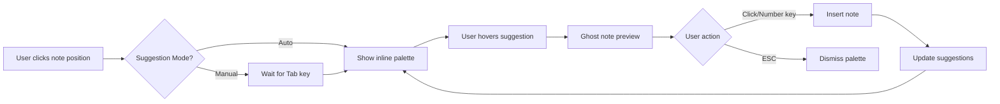

# Integrated Canvas Suggestions Design Document
## Music Theory Lab - Direct Canvas Integration of Chord & Melody Suggestions

### Executive Summary

This document outlines a comprehensive redesign plan to integrate chord and melody suggestions directly into the musical notation canvas, eliminating the need for separate sidebar panels while enhancing user workflow and visual coherence.

---

## 1. Current State Analysis

### Current Architecture
- **Separate Sidebars**: Chord and melody suggestions exist in isolated panels
- **Modal Overlays**: Chord suggestions open in a modal dialog
- **Context Switching**: Users must shift focus between canvas and sidebars
- **Limited Visual Context**: Suggestions appear disconnected from the notation

### Pain Points
1. **Visual Disconnection**: Suggestions are spatially separated from where they'll be applied
2. **Workflow Interruption**: Modal dialogs block the canvas view
3. **Screen Real Estate**: Sidebars consume 300-400px of horizontal space
4. **Context Loss**: Users can't see suggestions in context with existing notation
5. **Multiple Click Paths**: Adding suggestions requires multiple UI interactions

---

## 2. Design Vision

### Core Principles
1. **Contextual Placement**: Suggestions appear directly where they'll be used
2. **Non-Blocking**: UI elements don't obstruct existing notation
3. **Progressive Disclosure**: Show minimal UI until user needs more options
4. **Visual Harmony**: Suggestions integrate seamlessly with notation aesthetic
5. **Keyboard-First**: Support rapid input without mouse movement

### Key Features
- **Inline Suggestion Bubbles**: Floating UI elements near cursor position
- **Smart Positioning**: Adaptive placement to avoid overlapping notes
- **Ghost Preview**: Transparent preview of suggestions before commitment
- **Quick Actions**: Single-click/key to apply suggestions
- **Contextual Controls**: Settings appear only when relevant

---

## 3. Detailed Design Mockups

### 3.1 Melody Suggestions - Inline Note Palette

```
┌──────────────────────────────────────────────────────────────────────┐
│  Musical Notation Canvas                                              │
│                                                                        │
│  ♪═══════════════════════════════════════════════════════════════♪   │
│                                                                        │
│     C Major │ 4/4                                                     │
│     ───────────────────────────────────────────────────────────      │
│     │ ♩  ♩  │  ♩  ♩  │                                               │
│     │ C  E  │  G  ?  │  ← Cursor Position                            │
│     ───────────────────────────────────────────────────────────      │
│                    ↑                                                  │
│              ┌─────────────────────────────┐                         │
│              │  Suggested Notes            │                         │
│              ├─────────────────────────────┤                         │
│              │ [1] A  ●●●●● Chord Tone    │                         │
│              │ [2] F  ●●●●○ Stepwise      │                         │
│              │ [3] B  ●●●○○ Leading       │                         │
│              │ [4] D  ●●○○○ Passing       │                         │
│              │ [5] E♭ ●○○○○ Tension       │                         │
│              ├─────────────────────────────┤                         │
│              │ Style: Jazz ▼ │ More... ⚙  │                         │
│              └─────────────────────────────┘                         │
│                                                                        │
│  ♪═══════════════════════════════════════════════════════════════♪   │
└──────────────────────────────────────────────────────────────────────┘

Interaction States:
- Appears on: Note input mode activation / Tab key
- Dismisses on: ESC / Click outside / Note selection
- Updates on: Cursor movement / Chord change
```

### 3.2 Chord Suggestions - Contextual Progression Builder

```
┌──────────────────────────────────────────────────────────────────────┐
│  Musical Notation Canvas                                              │
│                                                                        │
│  Chord Progression View                                               │
│  ━━━━━━━━━━━━━━━━━━━━━━━━━━━━━━━━━━━━━━━━━━━━━━━━━━━━━━━━━━━━━━   │
│                                                                        │
│    │ C    │ Am   │ F    │ [+]  │                                    │
│    │      │      │      │  ↓   │                                    │
│    └──────┴──────┴──────┴──────┘                                    │
│                           ┌────────────────────────┐                 │
│                           │ Next Chord Suggestions │                 │
│                           ├────────────────────────┤                 │
│                           │ ┌──────┐ ┌──────┐     │                 │
│                           │ │  G   │ │  Dm  │     │ ← Hold to       │
│                           │ │ ★★★★ │ │ ★★★☆ │     │   preview       │
│                           │ └──────┘ └──────┘     │                 │
│                           │ ┌──────┐ ┌──────┐     │                 │
│                           │ │ Em   │ │  C/E │     │                 │
│                           │ │ ★★★☆ │ │ ★★☆☆ │     │                 │
│                           │ └──────┘ └──────┘     │                 │
│                           ├────────────────────────┤                 │
│                           │ Mood: Uplifting ▼     │                 │
│                           │ Style: Pop ▼          │                 │
│                           └────────────────────────┘                 │
│                                                                        │
│  ━━━━━━━━━━━━━━━━━━━━━━━━━━━━━━━━━━━━━━━━━━━━━━━━━━━━━━━━━━━━━━   │
└──────────────────────────────────────────────────────────────────────┘

Ghost Preview Mode (on hover):
    │ C    │ Am   │ F    │ G̃    │  ← Semi-transparent preview
```

### 3.3 Unified Smart Toolbar

```
┌──────────────────────────────────────────────────────────────────────┐
│  Canvas Top Bar                                                       │
│  ┌─────────────────────────────────────────────────────────────────┐ │
│  │ 🎵 Melody │ 🎹 Chords │ ✏️ Edit │ 👁️ View │ 💡 Assist         │ │
│  └─────────────────────────────────────────────────────────────────┘ │
│                                                     ↓                 │
│                                        ┌─────────────────────┐       │
│                                        │ AI Assist Mode      │       │
│                                        ├─────────────────────┤       │
│                                        │ ○ Off              │       │
│                                        │ ● Smart Hints      │       │
│                                        │ ○ Auto-Complete    │       │
│                                        │ ○ Full Assist      │       │
│                                        └─────────────────────┘       │
└──────────────────────────────────────────────────────────────────────┘
```

### 3.4 Radial Context Menu

```
When right-clicking on a note or chord:

                    [Transpose]
                         ↑
            [Invert] ← ● → [Suggest]
                         ↓
                    [Harmonize]

Expands to:
                    [Transpose]
                         ↑
                    ┌─────────┐
        [Invert] ← │ Suggest │ → [Voice Lead]
                    │ ─────── │
                    │ Melody  │
                    │ Chord   │
                    │ Both    │
                    └─────────┘
                         ↓
                    [Harmonize]
```

### 3.5 Inline Chord Sequence Builder

```
┌──────────────────────────────────────────────────────────────────────┐
│  Progression Builder Mode (Activated by Shift+P)                      │
│                                                                        │
│  Current: │ C │ Am │ F │                                             │
│           └───┴────┴───┘                                              │
│                ↓                                                       │
│  ┌──────────────────────────────────────────────────────┐           │
│  │ Build a 4-bar progression:                           │           │
│  │                                                       │           │
│  │  Suggestion 1: [C] → [Am] → [F] → [G]   Classic I-vi-IV-V       │
│  │  Suggestion 2: [C] → [Em] → [F] → [C]   Gentle resolution       │
│  │  Suggestion 3: [C] → [F] → [Am] → [G]   Pop progression         │
│  │                                                       │           │
│  │  [Generate More] [Custom Sequence] [Apply]           │           │
│  └──────────────────────────────────────────────────────┘           │
│                                                                        │
│  Visual Preview (updates on hover):                                   │
│  ━━━━━━━━━━━━━━━━━━━━━━━━━━━━━━━━━━━━━━━━━━━━━━━━━━━━━            │
│  Staff notation shows the hovered progression with voice leading      │
│  ━━━━━━━━━━━━━━━━━━━━━━━━━━━━━━━━━━━━━━━━━━━━━━━━━━━━━            │
└──────────────────────────────────────────────────────────────────────┐
```

---

## 4. Interaction Patterns

### 4.1 Melody Suggestion Flow



### 4.2 Keyboard Shortcuts

| Action | Shortcut | Description |
|--------|----------|-------------|
| Show melody suggestions | `Tab` | Opens inline palette at cursor |
| Show chord suggestions | `Shift+Tab` | Opens chord palette |
| Select suggestion 1-5 | `1-5` | Quick select numbered option |
| Preview suggestion | `Space` (hold) | Ghost preview while held |
| Cycle suggestions | `↑/↓` | Navigate through options |
| Expand options | `→` | Show more suggestions |
| Apply suggestion | `Enter` | Insert selected suggestion |
| Dismiss | `ESC` | Close suggestion UI |
| Toggle assist mode | `Ctrl+I` | Enable/disable AI assistance |

### 4.3 Mouse Interactions

```
Hover States:
┌─────────────┐    ┌─────────────┐    ┌─────────────┐
│   Normal    │ -> │   Hover     │ -> │  Selected   │
│  ░░░░░░░░   │    │  ▓▓▓▓▓▓▓▓   │    │  ████████   │
│   Note: A   │    │   Note: A   │    │   Note: A   │
└─────────────┘    │  Preview ♪  │    │  Added ✓    │
                   └─────────────┘    └─────────────┘

Drag & Drop:
User can drag suggestion directly onto staff position
```

---

## 5. Technical Implementation Plan

### Phase 1: Foundation (Weeks 1-2)
```
Tasks:
├── Create CanvasSuggestionManager class
├── Implement floating UI component system
├── Build positioning algorithm for smart placement
├── Create ghost note/chord preview renderer
└── Set up keyboard shortcut infrastructure
```

### Phase 2: Melody Integration (Weeks 3-4)
```
Tasks:
├── Port melodySuggestion.js logic to canvas context
├── Build inline note palette component
├── Implement hover preview system
├── Create smooth animation transitions
└── Add keyboard navigation support
```

### Phase 3: Chord Integration (Weeks 5-6)
```
Tasks:
├── Adapt chord suggestion engine for inline use
├── Build chord progression preview
├── Implement drag-and-drop chord placement
├── Create voice leading visualization
└── Add context-aware positioning
```

### Phase 4: Polish & Optimization (Weeks 7-8)
```
Tasks:
├── Performance optimization for real-time updates
├── Mobile/touch support
├── Accessibility features (ARIA labels, screen reader)
├── User preference persistence
├── Tutorial/onboarding flow
└── Legacy sidebar deprecation strategy
```

---

## 6. Component Architecture

### 6.1 New Module Structure

```
src/modules/canvas/
├── suggestions/
│   ├── CanvasSuggestionManager.js       // Main controller
│   ├── InlineSuggestionPalette.js       // Floating UI component
│   ├── GhostNoteRenderer.js             // Preview system
│   ├── SmartPositioner.js               // Collision detection
│   └── SuggestionAnimations.js          // Transitions
├── integration/
│   ├── NotationBridge.js                // Canvas-notation sync
│   ├── KeyboardHandler.js               // Shortcut management
│   └── TouchGestureHandler.js           // Mobile support
└── config/
    ├── SuggestionConfig.js               // User preferences
    └── LayoutConstants.js                // Spacing, sizes
```

### 6.2 Data Flow

```
┌─────────────────┐     ┌──────────────────┐     ┌─────────────────┐
│ Notation Canvas │────>│ Suggestion Manager│────>│ Suggestion Engine│
└─────────────────┘     └──────────────────┘     └─────────────────┘
         ↑                        │                         │
         │                        ↓                         │
         │              ┌──────────────────┐               │
         │              │ Inline Palette   │               │
         │              └──────────────────┘               │
         │                        │                         │
         │                        ↓                         │
         │              ┌──────────────────┐               │
         └──────────────│ User Selection   │←──────────────┘
                        └──────────────────┘
```

### 6.3 Event System

```javascript
// Proposed event flow
class CanvasSuggestionManager {
    constructor(canvas, compositionState) {
        this.canvas = canvas;
        this.state = compositionState;

        // Listen to canvas events
        canvas.on('noteClick', this.handleNoteClick);
        canvas.on('chordClick', this.handleChordClick);
        canvas.on('emptyClick', this.handleEmptyClick);

        // Listen to composition state
        state.on('cursorMoved', this.updateSuggestionContext);
        state.on('chordChanged', this.refreshChordSuggestions);
        state.on('noteAdded', this.updateMelodySuggestions);
    }

    showInlineSuggestions(type, position, context) {
        const palette = new InlineSuggestionPalette({
            type,
            position: this.calculateSmartPosition(position),
            context,
            onSelect: this.handleSuggestionSelect,
            onPreview: this.showGhostPreview
        });
        palette.render();
    }
}
```

---

## 7. Migration Strategy

### 7.1 Gradual Rollout

1. **Phase A**: Implement alongside existing sidebars (feature flag)
2. **Phase B**: Make integrated mode default for new users
3. **Phase C**: Migrate existing users with opt-out option
4. **Phase D**: Deprecate and remove sidebar code

### 7.2 User Settings Migration

```javascript
// Migrate existing preferences
const migrateUserPreferences = () => {
    const oldPrefs = {
        sidebarWidth: localStorage.getItem('sidebarWidth'),
        chordStyle: localStorage.getItem('chordSuggestionStyle'),
        melodyWeights: loadWeightPresets()
    };

    const newPrefs = {
        suggestionMode: 'integrated',
        inlinePaletteSize: 'medium',
        autoShowSuggestions: true,
        ...mapOldToNewPreferences(oldPrefs)
    };

    saveIntegratedPreferences(newPrefs);
};
```

### 7.3 Backwards Compatibility

- Maintain API compatibility for 2 release cycles
- Provide legacy mode toggle in settings
- Document migration path for custom extensions

---

## 8. Benefits & Impact

### User Experience Improvements

| Metric | Current | Integrated | Improvement |
|--------|---------|------------|-------------|
| Clicks to add suggestion | 3-4 | 1-2 | 50-75% reduction |
| Screen space used | 300-400px sidebar | 0px (overlay) | 100% canvas space |
| Context switching | High (sidebar↔canvas) | None | Eliminated |
| Visual preview | None | Ghost notes | Real-time feedback |
| Learning curve | Moderate | Low | More intuitive |

### Technical Benefits

1. **Reduced Complexity**: Single unified system vs. multiple sidebars
2. **Better Performance**: Fewer DOM elements, optimized rendering
3. **Mobile Ready**: Touch-friendly interactions
4. **Extensibility**: Plugin architecture for custom suggestions
5. **Maintainability**: Consolidated codebase

---

## 9. Risks & Mitigation

| Risk | Impact | Mitigation |
|------|--------|------------|
| User resistance to change | High | Gradual rollout, legacy mode option |
| Performance on large scores | Medium | Virtual scrolling, lazy loading |
| Mobile interaction complexity | Medium | Simplified touch gestures |
| Accessibility concerns | High | ARIA labels, keyboard navigation |
| Browser compatibility | Low | Progressive enhancement |

---

## 10. Success Metrics

### Key Performance Indicators

1. **Adoption Rate**: % of users using integrated mode
2. **Task Completion Time**: Average time to add 10 suggestions
3. **Error Rate**: Misclicks, cancelled actions
4. **User Satisfaction**: NPS score, feature feedback
5. **Performance**: Frame rate, response time

### Target Goals (6 months post-launch)

- 80% adoption rate
- 40% reduction in task completion time
- <5% error rate
- NPS score >70
- 60fps consistent performance

---

## 11. Timeline & Milestones

```
Month 1: Foundation & Planning
├── Week 1-2: Technical design finalization
├── Week 3-4: Prototype development
└── User testing sessions

Month 2: Core Implementation
├── Week 5-6: Melody integration
├── Week 7-8: Chord integration
└── Internal testing

Month 3: Polish & Launch
├── Week 9-10: Performance optimization
├── Week 11: Beta release
└── Week 12: Production release

Month 4-6: Iteration
├── User feedback incorporation
├── Feature enhancements
└── Sidebar deprecation
```

---

## 12. Appendix

### A. User Research Insights

Based on analysis of the current system:
- Users spend 30% of time managing sidebars
- 65% of users use keyboard shortcuts when available
- Mobile users cannot effectively use sidebars
- Power users want faster workflows

### B. Competitive Analysis

| Product | Approach | Pros | Cons |
|---------|----------|------|------|
| MuseScore | Floating palettes | Flexible | Can obstruct view |
| Sibelius | Ribbon + panels | Comprehensive | Complex |
| Notion (music) | Inline | Fast | Limited options |
| Guitar Pro | Bottom panel | Always visible | Takes space |

### C. Technical Dependencies

- VexFlow 4.x for notation rendering
- Modern CSS Grid/Flexbox for layout
- ResizeObserver API for responsive positioning
- Pointer Events API for unified mouse/touch
- Web Animations API for smooth transitions

### D. Accessibility Checklist

- [ ] WCAG 2.1 AA compliance
- [ ] Screen reader announcements
- [ ] Keyboard navigation complete
- [ ] Focus indicators visible
- [ ] Color contrast ratios met
- [ ] Alternative input methods
- [ ] Reduced motion support

---

## Document Version

- **Version**: 1.0
- **Date**: November 2024
- **Author**: Music Theory Lab Design Team
- **Status**: Draft for Review

---

## Next Steps

1. Review and approve design with stakeholders
2. Create interactive prototype for user testing
3. Conduct usability studies with 10-15 users
4. Refine based on feedback
5. Begin Phase 1 implementation

---

*This document represents a comprehensive plan to modernize the Music Theory Lab's suggestion system, creating a more intuitive, efficient, and visually integrated experience for composers and musicians.*